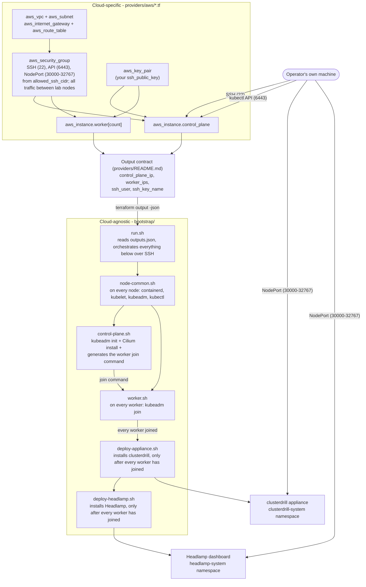
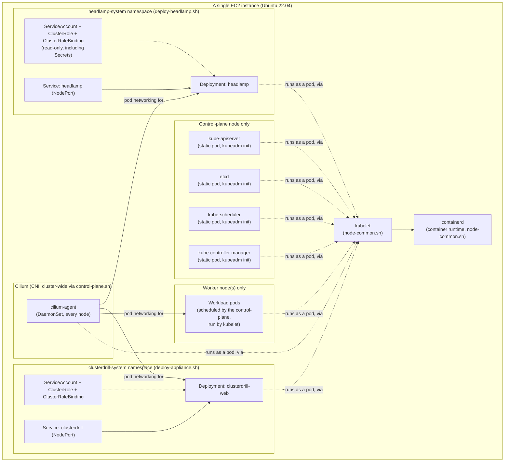
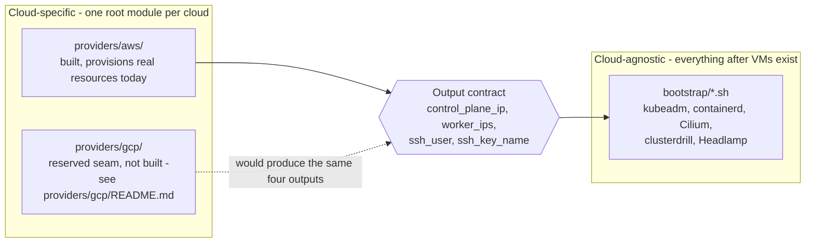

# Architecture overview

This doc is for a reader who hasn't opened any other file in this repository yet.
It shows what creates the VMs, what installs Kubernetes, what installs the CNI, and what installs
the practice-bank app - in that order - without requiring you to read any `.tf` or `.sh` file
first.

Two layers, with one seam between them:

- **Cloud-specific** (`providers/aws/`): Terraform that provisions VMs on one cloud and hands back
  a small, fixed set of outputs.
- **Cloud-agnostic** (`bootstrap/`, and everything after VMs exist): shell scripts that turn those
  VMs into a working Kubernetes cluster with the practice-bank appliance and a dashboard installed,
  using only the four values the Terraform layer produced.

See [`providers/README.md`](../providers/README.md) and [`CONTRIBUTING.md`](../CONTRIBUTING.md#the-one-hard-rule-bootstrap-stays-cloud-agnostic)
for why that seam is a hard rule, not just a convention.

## 1. Top-level flow: from empty AWS account to a reachable appliance

Reading order:

1. **`providers/aws/*.tf`** provisions a VPC, subnet, internet gateway, route table, one security
   group, a key pair from your own public key, one control-plane EC2 instance, and one or more
   worker EC2 instances. Nothing here installs Kubernetes - see
   [`providers/aws/README.md`](../providers/aws/README.md).
2. Terraform's outputs are the **only** channel between the two layers: `control_plane_ip`,
   `worker_ips`, `ssh_user`, `ssh_key_name` - see
   [`providers/README.md`](../providers/README.md#the-common-output-contract). `bootstrap/` has no
   AWS-specific code anywhere; it only ever reads these four values.
3. **`bootstrap/run.sh`** reads that JSON and, over SSH, drives every other script in order: first
   `node-common.sh` on every node, then `control-plane.sh` on the control-plane node alone, then
   `worker.sh` on each worker once the join command exists. Only after every worker has joined does
   it run `deploy-appliance.sh` and then `deploy-headlamp.sh` - both Deployments lack a toleration
   for the control-plane's own taint, so deploying either earlier just hangs until `kubectl rollout
   status` times out. See [`bootstrap/README.md`](../bootstrap/README.md#flow) for the full flow this
   diagram mirrors.
4. The result is a running **`clusterdrill`** appliance (`clusterdrill-system` namespace) and a
   **Headlamp** dashboard (`headlamp-system` namespace), each exposed as a `NodePort` Service. The
   security group's `nodeport_range` rule already permits reaching both from the operator's own
   CIDR - see [`providers/aws/README.md`](../providers/aws/README.md#verifying-the-lab) and its
   [Headlamp section](../providers/aws/README.md#headlamp-dashboard) for the exact commands and
   login flow.

## 2. Component diagram: inside a single node

One level down, showing where the container runtime, kubeadm-managed control-plane pods (or
kubelet-managed workload pods on a worker), Cilium, and the two application namespaces actually
sit.

Notes:

- The control-plane's static pods (`kube-apiserver`, `etcd`, `kube-scheduler`,
  `kube-controller-manager`) exist only on the control-plane node, are managed by kubelet reading
  manifests kubeadm wrote to `/etc/kubernetes/manifests`, and are what `kubeadm init` in
  `control-plane.sh` sets up. Ordinary workload pods (including `clusterdrill-web` and `headlamp`,
  both scheduled onto a worker in a real multi-node lab, since neither Deployment tolerates the
  control-plane's taint) are kubelet-managed the same way on whichever node they land on - just
  without the static-pod manifests.
- Cilium runs as a DaemonSet (`cilium-agent`) on every node, control-plane and worker alike -
  installed once, cluster-wide, by `control-plane.sh` via the `cilium` CLI.
- `clusterdrill-system` and `headlamp-system` are two independent namespaces, each with its own
  Deployment, NodePort Service, and RBAC (ServiceAccount + ClusterRole + ClusterRoleBinding) -
  neither depends on the other. Headlamp's ClusterRole is deliberately read-only (`get`/`list`/`watch`
  only, including Secrets); the appliance's ClusterRole additionally has the verbs its practice
  questions need to apply and grade candidate-authored resources. See
  [`dashboard/headlamp-manifest.yaml`](../dashboard/headlamp-manifest.yaml) and
  [`providers/aws/README.md`'s Headlamp section](../providers/aws/README.md#headlamp-dashboard).

## 3. What's cloud-specific vs. cloud-agnostic

`providers/aws/` is the only implemented provider; `providers/gcp/` is an intentionally empty,
documented seam (see [`providers/gcp/README.md`](../providers/gcp/README.md)) - not diagrammed with
any internal resources here because none exist yet. Adding GCP support means writing
`providers/gcp/*.tf` that produces the same four outputs; nothing under `bootstrap/` would need to
change. `bootstrap/` itself has no `aws_*`, `gcp_*`, or other cloud-specific code, environment
variable, or metadata-service call anywhere in it - see
[`CONTRIBUTING.md`](../CONTRIBUTING.md#the-one-hard-rule-bootstrap-stays-cloud-agnostic) for the hard
rule this enforces and how to verify it yourself with `grep`.

## Out of scope for this doc

The Minikube-based local-appliance path (the practice-bank repository's own separate deployment
mode, which creates its cluster via Minikube internally) does not use this repository's
provider+bootstrap flow at all and is not covered here.
